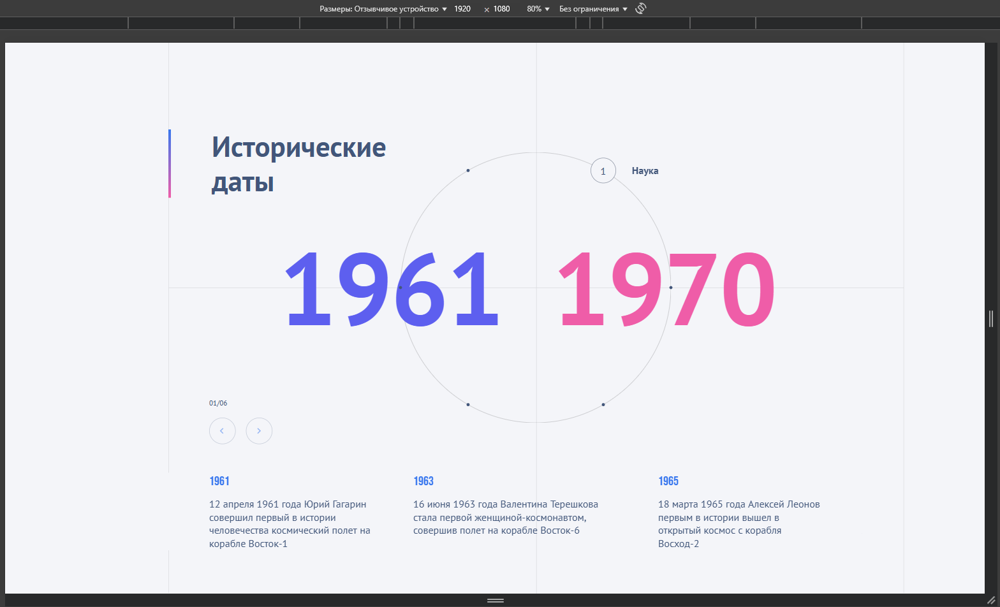

Верстка странички выполнена согласно макетам.  
Для 1920×1080 и 320×568 разрешений дисплеев.

## Запуск проекта

Чтобы запустить проект необходимо:

1. Клонировать репозиторий
2. Находясь в директории проекта, выполнить команду:
   ```bash
   npm i
   ```
3. После окончания загрузки выполнить:
   ```
   npm start
   ```



